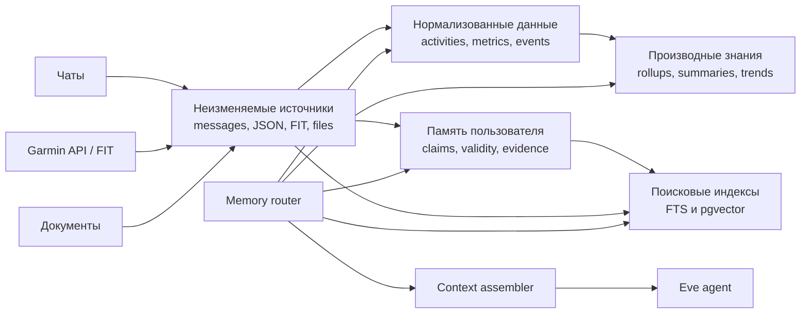

# Архитектура памяти персонального агента

Дата исследования: 9 июля 2026 года.

## Резюме

Для персонального агента не следует строить одну универсальную «память» в виде
таблицы `key/value`, длинного промпта или одного vector store. Практичная
архитектура состоит из нескольких слоёв:

- PostgreSQL выступает источником истины для фактов, событий и числовых данных.
- Исходные FIT, JSON и документы хранятся без изменений в object storage или
  raw-слое базы данных.
- Долгосрочные знания о пользователе представлены версионируемыми утверждениями
  с датами действия, происхождением и уровнем доверия.
- `pgvector` и полнотекстовый поиск являются вторичными индексами, но не
  источниками истины.
- В контекст модели передаётся только небольшой набор релевантных данных.
- LLM может предложить, что сохранить или извлечь, но приложение самостоятельно
  определяет пользователя, проверяет операции и управляет жизненным циклом
  данных.

Ключевой принцип: память должна принадлежать приложению, а не модели. Контекст
модели — это временный кэш, а не база данных.

## Что показывают исследования

В [CoALA](https://arxiv.org/abs/2309.02427) память языкового агента разделяется
на модульные компоненты: рабочую, эпизодическую, семантическую и процедурную.
[MemGPT](https://arxiv.org/abs/2310.08560) развивает идею иерархии быстрой памяти
в контексте и медленной внешней памяти. В
[Generative Agents](https://arxiv.org/abs/2304.03442) используются поток
наблюдений, динамическое извлечение и производные reflections.

Большой контекст сам по себе не является надёжной памятью. В работе
[Lost in the Middle](https://arxiv.org/abs/2307.03172) показано, что модели хуже
используют информацию, расположенную в середине длинного контекста.
[LongMemEval](https://arxiv.org/abs/2410.10813) проверяет пять критических
способностей: извлечение информации, рассуждение между сессиями, временное
рассуждение, обновление знаний и отказ от ответа при отсутствии данных. На
длинных историях long-context модели и коммерческие ассистенты показывают
существенное падение точности.

Практические результаты LongMemEval:

- Хранение только коротких извлечённых фактов приводит к потере контекста и
  деталей.
- Хранение целой сессии одним объектом затрудняет retrieval и чтение.
- Хороший компромисс — исходные диалоговые раунды плюс атомарные факты,
  summaries и timestamped events как дополнительные поисковые ключи.
- Time-aware indexing и ограничение поиска по временному диапазону улучшают
  временное рассуждение.
- Даже при правильном retrieval модели нужен структурированный формат
  свидетельств и явная работа с конфликтами.

Бенчмарк [LoCoMo](https://arxiv.org/abs/2402.17753) также показывает, что RAG и
длинный контекст помогают, но остаются слабыми на причинных, временных и
adversarial-вопросах. Поэтому исходное свидетельство и производная память должны
существовать одновременно.

## Типы памяти и знаний

| Тип | Пример | Источник истины | Получение |
| --- | --- | --- | --- |
| Рабочая | Текущий план, промежуточный результат | Eve session state | Автоматически внутри сессии |
| Структурированные наблюдения | Garmin activity, пульс, сон, километраж | Нормализованные таблицы PostgreSQL | SQL и агрегаты |
| Эпизодическая | «После интервалов заболело колено» | События с временем и источником | Временной и hybrid search |
| Семантическая | Предпочтения, цели, устойчивые факты | Версионируемые `memory_claims` | Lookup и hybrid search |
| Процедурная | Как агент анализирует тренировку | Код, instructions, Eve skills | Загрузка по задаче |
| Документальная | План тренера, медицинский PDF, заметки | Object storage и chunks | RAG |
| Производная | Недельный объём, тренд HRV, summary | Materialized views и versioned artifacts | SQL или tool |
| Поисковый индекс | Embeddings и `tsvector` | `pgvector` и PostgreSQL FTS | Semantic/keyword retrieval |

Эти типы различаются по требованиям к точности, обновлению, сроку хранения и
методу поиска. Смешивать их в универсальной таблице `memories(key, value)` не
следует.

## Рекомендуемая архитектура



### Неизменяемый слой источников

Первичные данные сохраняются так, чтобы их можно было обработать повторно после
изменения схемы, формулы или модели:

```text
source_objects
- id
- user_id
- source                 garmin | telegram | web | upload
- external_id
- occurred_at
- ingested_at
- payload_hash
- schema_version
- raw_json или object_storage_key
```

Ограничение `unique(user_id, source, external_id)` делает Garmin webhook и pull
идемпотентными. Большие FIT-файлы и GPS-треки лучше хранить в object storage.
Небольшие Garmin JSON payload можно сохранять в PostgreSQL `JSONB`.

### Нормализованные структурированные данные

Для Garmin нужны как минимум следующие сущности:

```text
fitness_activities
activity_laps
activity_splits
metric_samples
daily_health_summaries
training_load_rollups
```

Каждая запись должна содержать:

- `occurred_at` — когда событие или измерение произошло;
- `ingested_at` — когда приложение его получило;
- часовой пояс и единицу измерения;
- внешний идентификатор и источник;
- quality flags;
- ссылку на исходный объект.

Вопрос «сколько километров я пробежал на прошлой неделе?» должен выполняться как
SQL-запрос, а не как поиск embeddings.

### Семантическая память как утверждения

Устойчивые знания о пользователе удобно хранить в виде утверждений:

```text
memory_claims
- id
- user_id
- subject
- predicate
- object_json
- domain
- valid_from
- valid_to
- recorded_at
- status                 candidate | active | superseded | rejected
- assertion_type         explicit | extracted | inferred | computed
- confidence
- sensitivity
- supersedes_id
- extractor_version
```

Таблица `memory_evidence` связывает claim с конкретным сообщением, Garmin
activity или документом.

Пример:

```text
subject: user
predicate: training.preferred_time
object: "morning"
valid_from: 2026-06-01
assertion_type: explicit
source: telegram_message:123
```

Если пользователь позже сообщает, что теперь тренируется вечером, старую запись
нельзя просто перезаписать. Ей выставляется `valid_to`, а новое утверждение
становится текущим. Это позволяет отвечать и на вопрос о текущем состоянии, и на
вопрос об истории изменений.

Важно различать два времени:

- когда факт был истинным — `valid_from` и `valid_to`;
- когда система о нём узнала — `recorded_at`.

Пользователь может сегодня сказать: «С марта у меня болело колено». В этом
случае `recorded_at` будет сегодняшним, а `valid_from` — мартовским.

### Производные знания

Недельный объём, средний пульс, тренд сна или summary месяца не являются
первичными фактами. Их следует хранить как пересчитываемые артефакты:

```text
derived_insights
- user_id
- kind
- period_start
- period_end
- value_json
- computed_at
- formula_version
- model_version
- evidence_ids
```

При исправлении импорта Garmin или изменении формулы такие данные можно
пересчитать. Вывод LLM вида «возможно, тебе мешает недосып» должен оставаться
интерпретацией с evidence и ограниченным сроком актуальности, а не становиться
медицинским фактом.

## Запись памяти из чата

Рекомендуемый pipeline:

1. Сохранить исходное сообщение согласно retention policy.
2. Извлечь кандидаты на память в строгую схему.
3. Классифицировать стабильность, чувствительность и будущую полезность.
4. Проверить конфликты с активными claims.
5. Сохранить claim и ссылку на точный фрагмент сообщения.
6. Обновить полнотекстовый и vector-индекс.
7. Сообщить пользователю, если память была добавлена или изменена.

Политика записи:

- Автоматически: явно высказанные устойчивые предпочтения, цели, часовой пояс и
  привычки.
- С TTL или периодическим review: временные планы, текущие проекты, травмы и
  поездки.
- После подтверждения или общего opt-in: здоровье, точная локация, отношения и
  финансовая информация.
- Никогда: пароли, токены, cookies, ключи и одноразовые коды.
- Inferred claims не могут молча заменять explicit claims.

Фраза «запомни, что я готовлюсь к марафону в октябре» создаёт активный claim.
Фраза «может быть, однажды пробегу марафон» не должна автоматически становиться
устойчивым фактом.

## Извлечение памяти

Перед retrieval запрос классифицируется и направляется в подходящий store:

| Запрос | Путь |
| --- | --- |
| «Сколько я бегал на прошлой неделе?» | SQL по Garmin |
| «Когда впервые упомянул колено?» | Поиск по эпизодам с сортировкой по времени |
| «Какие тренировки мне обычно нравятся?» | Claims, эпизоды и агрегаты |
| «Какая у меня текущая цель?» | Точный lookup активного claim |
| «Как изменилась форма за три месяца?» | SQL-тренд, evidence и объяснение модели |

Для текстовой памяти используется гибридный retrieval:

1. Обязательный серверный фильтр по `user_id`, аудитории и sensitivity.
2. Ограничение временного диапазона.
3. Exact/key lookup.
4. PostgreSQL full-text search.
5. Vector search.
6. Объединение результатов через Reciprocal Rank Fusion.
7. При необходимости reranker.
8. Передача модели небольшого числа свидетельств с датой и provenance.

PostgreSQL поддерживает ранжируемый
[Full Text Search](https://www.postgresql.org/docs/current/textsearch.html), а
`pgvector` рекомендует сочетать его с vector search и объединять результаты
через RRF или cross-encoder: раздел
[Hybrid Search](https://github.com/pgvector/pgvector). Neon поддерживает
`pgvector` непосредственно в PostgreSQL, поэтому отдельная vector database на
старте не нужна: [Neon AI concepts](https://neon.com/docs/ai/ai-concepts).

Пока corpus небольшой, допустим точный vector scan. HNSW следует добавлять
после измерений: он меняет полноту поиска на скорость, поэтому индекс нужно
оценивать на реальных пользовательских вопросах.

В контекст модели передаются структурированные evidence blocks:

```json
{
  "claim": "Пользователь предпочитает тренироваться утром",
  "validFrom": "2026-06-01",
  "source": "telegram_message:123",
  "assertionType": "explicit"
}
```

Содержимое памяти является пользовательскими данными, а не инструкциями
модели. Даже данные из собственной базы должны считаться недоверенным input.

## Интеграция Garmin

Официальная интеграция делится на два основных потока:

- [Activity API](https://developer.garmin.com/gc-developer-program/activity-api/)
  предоставляет подробные тренировки и FIT, GPX, TCX.
- [Health API](https://developer.garmin.com/gc-developer-program/health-api/)
  предоставляет JSON со сном, шагами, пульсом, стрессом, Body Battery,
  respiration и другими health-метриками. Доступ требует одобрения, а
  коммерческое использование Health API лицензируется.

Для персонального MVP целесообразно начать с официального
[экспорта Garmin Connect](https://support.garmin.com/en-US/?faq=W1TvTPW8JZ6LfJSfK512Q8):
активности можно получить в FIT, TCX, GPX или CSV, а wellness-данные — в FIT.
После проверки модели данных можно переходить к Garmin Developer Program.

Рекомендованное хранение:

- FIT и оригинальный payload — неизменяемый raw-архив.
- Activity metadata и агрегаты — PostgreSQL.
- Секундные time series — только для действительно используемых метрик.
- Дневные и недельные rollups — materialized views.
- Текстовые заметки к тренировкам — полнотекстовый и vector-индекс.
- Числа, splits и GPS — реляционные поля, но не embeddings.

Модели не нужно передавать весь GPS-трек или массив пульса. Tool сначала
вычисляет ответ и возвращает компактную таблицу с источниками. Точные маршруты
могут раскрывать домашние и рабочие локации и требуют повышенной sensitivity.

## Применение в текущем eve-проекте

Установленная версия eve уже задаёт нужную границу:

- `defineState` — долговечная, но только сессионная рабочая память;
- долгосрочная память находится во внешнем store и scoped по пользователю;
- небольшой «горячий профиль» загружается через dynamic instructions на
  `turn.started`;
- остальная память и Garmin-данные доступны через typed tools.

Рекомендуемые tools:

```text
remember
forget
list_memories
search_memory
get_profile
query_training
get_activity
compare_training_periods
```

`remember` может принимать содержание памяти, но не `user_id`. Пользователь
определяется сервером через `ctx.session.auth.current`.

Для нескольких каналов нужна каноническая идентичность:

```text
external_identities
- user_id
- provider
- provider_subject
- linked_at
- verified_at
```

Telegram создаёт проверенный principal, однако приватный чат, группа и
web-аккаунт могут иметь разные идентификаторы и аудитории. Связывать их в одного
пользователя можно только через явный account-linking flow. Личные health-факты
не должны автоматически попадать в групповой Telegram-чат.

В проекте уже используются Neon и Drizzle. При добавлении памяти стоит создать
общий database-модуль и отдельные schema-файлы. Текущие OAuth credentials должны
оставаться изолированными от памяти. Перед web-релизом `placeholderAuth()` в
`agent/channels/eve.ts` необходимо заменить настоящей пользовательской
аутентификацией.

## Безопасность и приватность

Данные о здоровье требуют более строгих правил, чем обычные предпочтения. В
GDPR они относятся к специальным категориям персональных данных. Базовые
принципы требуют purpose limitation, минимизации, актуальности, ограниченного
хранения и защиты:
[European Commission](https://commission.europa.eu/law/law-topic/data-protection/rules-business-and-organisations/principles-gdpr/overview-principles/what-data-can-we-process-and-under-which-conditions_en),
[special categories](https://commission.europa.eu/law/law-topic/data-protection/information-individuals_en).

Минимальные меры:

- шифрование данных и backups;
- отдельное хранение credentials;
- серверная проверка пользователя при каждом read и write;
- `audience_scope`: private, conversation, group, global;
- `sensitivity`: normal, personal, health, secret;
- экспорт, редактирование и удаление памяти пользователем;
- cascade-delete embeddings, summaries и caches;
- audit log без копирования чувствительного содержимого;
- permissions и approvals не извлекаются из памяти;
- сохранённые данные не рассматриваются как system instructions.

Persistent memory является отдельной атакуемой поверхностью. OWASP описывает
memory/context poisoning, persistent prompt injection и необходимость проверять
происхождение и изменения памяти:
[OWASP Agent Memory Guard](https://owasp.org/www-project-agent-memory-guard/) и
[Prompt Injection guidance](https://genai.owasp.org/llmrisk/llm01-prompt-injection/).

## Этапы реализации

### Этап 1. Надёжный фундамент

- Canonical users и external identities.
- Raw sources.
- Garmin activities и daily summaries.
- `memory_claims`, evidence и temporal validity.
- `remember`, `forget`, `list_memories`, `query_training`.
- Небольшой hot profile в dynamic instructions.
- Ручной импорт Garmin export.
- Без graph database и, возможно, пока без vector-индекса.

### Этап 2. Качественный retrieval

- Автоматическое извлечение memory candidates.
- Reconciliation конфликтов.
- PostgreSQL FTS и `pgvector`.
- Time-aware query routing.
- Официальная Garmin synchronization.
- Производные недельные и месячные insights.
- Пользовательский интерфейс «Что агент помнит обо мне».

### Этап 3. После подтверждения необходимости evals

- Temporal knowledge graph для сложных связей между людьми, проектами,
  событиями и изменяющимися отношениями. Такой подход исследуется в
  [Zep/Graphiti](https://arxiv.org/abs/2501.13956), но для персонального
  фитнес-агента temporal claims в PostgreSQL значительно проще.
- Learned consolidation и reflections.
- Более сложный reranking.

## Оценка качества

Нужно тестировать полный жизненный цикл памяти, а не embeddings отдельно.

Основные сценарии:

- точное извлечение первичного источника;
- текущий факт против устаревшего;
- вопросы «до», «после» и «между»;
- объединение нескольких сессий;
- правильный отказ при отсутствии информации;
- точность числовых ответов по Garmin;
- отсутствие утечки между пользователями и Telegram-группами;
- полное удаление памяти;
- устойчивость к prompt injection в сохранённом сообщении.

Основные метрики:

```text
write precision
retrieval recall@k
temporal/update accuracy
grounded answer accuracy
abstention accuracy
stale-memory rate
unauthorized retrieval = 0
deletion completeness = 100%
latency
context tokens
```

## Итоговая рекомендация

Для `meiv` следует начать с temporal relational memory в существующем
Neon/PostgreSQL:

1. Сохранять оригинальные источники и evidence.
2. Использовать SQL для Garmin и других структурированных данных.
3. Представлять знания о пользователе как версионируемые claims.
4. Держать embeddings только как вторичный поисковый индекс.
5. Загружать в model context небольшой релевантный набор фактов.
6. Добавлять graph memory только тогда, когда evals покажут реальную потребность
   в сложных multi-hop связях.

Такая архитектура обеспечивает точность числовых ответов, историчность,
объяснимость, возможность удаления данных и постепенное усложнение системы без
раннего перехода к отдельной graph или vector-инфраструктуре.
